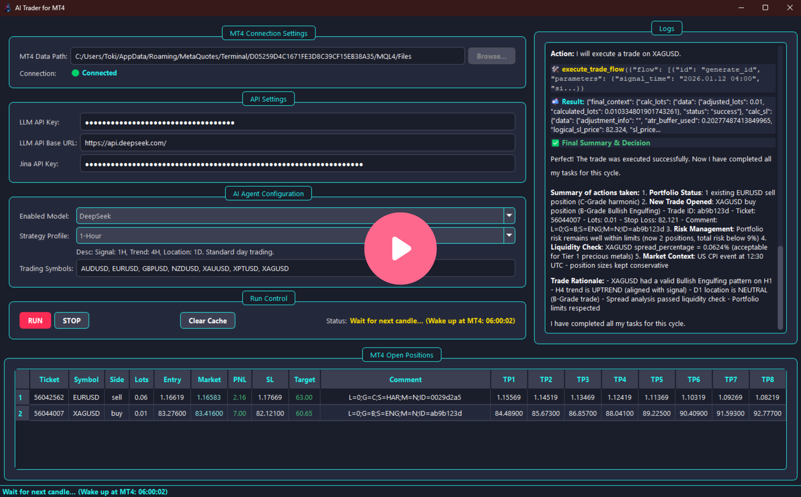
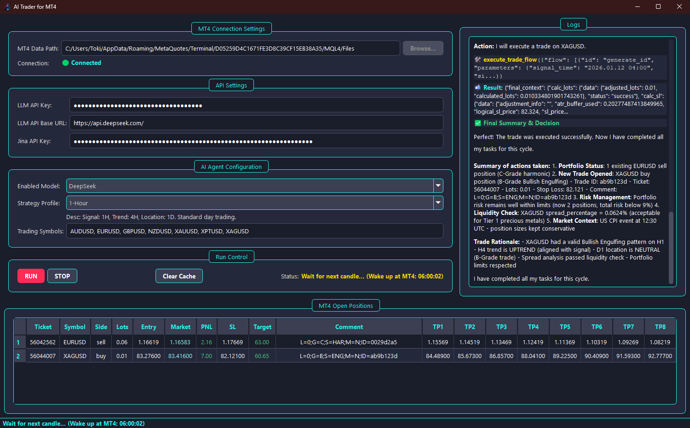
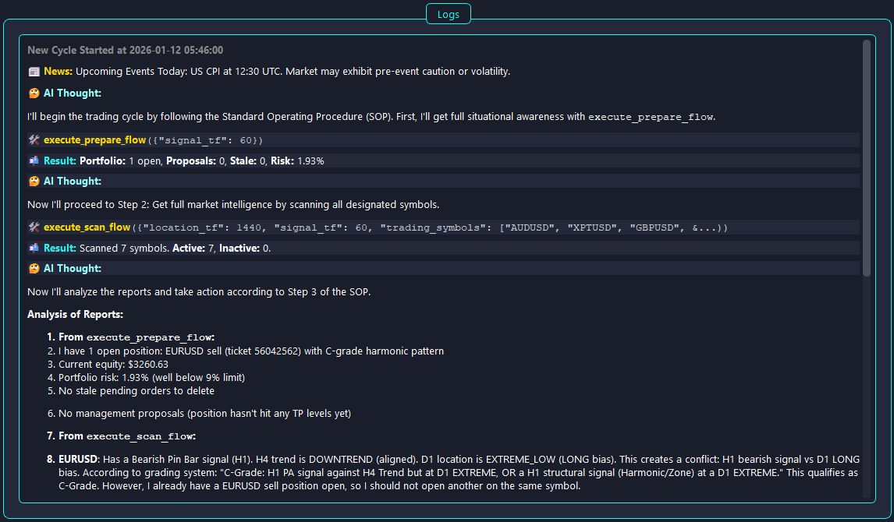
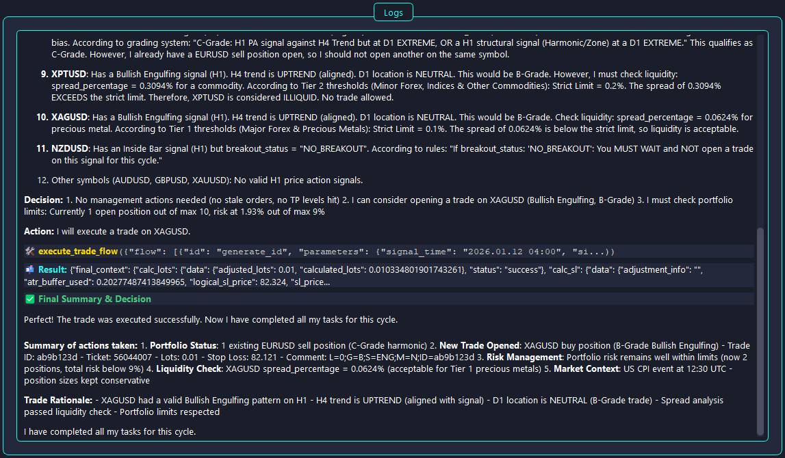

# AI-Trader-For-MT4: An LLM-Powered Autonomous Trading Bot Framework for MT4

[简体中文](./README.md) | [English](./README_en.md)

[](https://github.com/toki-plus/ai-trader-for-mt4/stargazers)
[](https://github.com/toki-plus/ai-trader-for-mt4/network/members)
[](https://github.com/toki-plus/ai-trader-for-mt4/pulls)
[](https://choosealicense.com/licenses/mit/)

**`AI-Trader-For-MT4` is a revolutionary, open-source AI trading solution that transforms a Large Language Model (LLM) from a conversational tool into an autonomous trading agent capable of "Perceive-Think-Act" cycles on the MetaTrader 4 (MT4) platform, by endowing it with a "Trading Constitution" and a comprehensive toolset.**

This project is designed to provide quantitative traders, strategy researchers, and developers with an ultimate framework to "instill" their complex trading philosophies, risk management disciplines, and operational procedures into an AI through highly structured prompts, which the AI then strictly and autonomously executes. It completely breaks free from the constraints of traditional EA programming, ushering in a new paradigm of defining and iterating trading strategies through natural language.

<p align="center">
  <a href="https://www.bilibili.com/video/BV1gVrhBgE6L/" target="_blank">
    
  </a>
  <br>
  <em>(Click the cover to watch the HD demo video on Bilibili)</em>
</p>

---

## ✨ Core Features

This project builds a true AI autonomous trading ecosystem through the precise collaboration of five core modules:

### 🧠 Grandmaster AI Trader

-   **Agentic Workflow**: The AI follows a ReAct-like (Reason + Act) thinking model, strictly adhering to a **`Prepare -> Scan -> Act -> Conclude`** Standard Operating Procedure (SOP). Each step relies on structured reports returned by tools, not on arbitrary reasoning.
-   **"Trading Constitution" System**: `prompts.py` defines an extremely detailed set of system-level instructions, serving as the AI's "Trading Constitution." It includes:
    -   **Core Philosophy**: Principles like "Survival First, Profit Second" and "Three-Timeframe Confluence."
    -   **Absolute Laws**: Ironclad rules such as a 2% max risk per trade, 9% max total portfolio risk, and a limit of 10 open positions.
    -   **Liquidity Review**: An innovative **Relative Spread Cost** concept that enables the AI to intelligently judge market liquidity based on the spread percentage for different asset classes (e.g., major forex, precious metals, cryptocurrencies), avoiding high transaction cost traps.
    -   **Signal Grading System**: Strictly grades potential trading opportunities into A, B, and C tiers and defines "No-Trade" zones to eliminate low-quality entries.
    -   **Refined Execution Directives**: Specifies different execution details for various signals (e.g., pending order entry for a Pin Bar vs. breakout entry for an Inside Bar).
    -   **Profit Ladder Management**: A built-in, complete position management strategy for taking partial profits and trailing stop losses.
-   **Multi-Model Compatibility**: Easily switch between leading LLMs like **OpenAI (GPT-4o)**, **DeepSeek**, and **Moonshot (Kimi)** in `config/mt4_config.json` to select the best "brain" for your AI trader.
-   **Fully Transparent Decision Logs**: Every step of the AI's **Thought**, **Tool Calls**, and **Observation** is recorded and displayed in the GUI, allowing you to deeply review every detail of the AI's decision-making process.

### 🛠️ Workflow-Driven Two-Tier Tool System

-   **High-Level Flow Tools**: Located in `src/tools/tool_flows.py`, these are the AI's primary interface. The four major workflows—`execute_prepare_flow`, `execute_scan_flow`, `execute_trade_flow`, and `execute_management_flow`—encapsulate dozens of atomic operations into high-level commands, dramatically increasing the AI's decision-making efficiency and forcing adherence to the SOP.
-   **Comprehensive Atomic Tools**: Located in various files within `src/tools/`, providing over 30 granular, low-level tools, including:
    -   **Market Analysis & Pattern Recognition**: From basic candlestick data retrieval to automated **price action scanning** (`scan_for_price_action`) and **harmonic/supply-demand zone scanning** (`scan_for_structures`).
    -   **Dynamic Stop-Loss Calculation**: The core `calculate_stop_loss_from_pattern` tool dynamically computes the most reasonable stop-loss position based on different signal types (Pin Bar, Engulfing, Zone, etc.) and includes a built-in **ATR safety buffer** to prevent stops from being too tight.
    -   **Precise Lot Size Calculation**: The `calculate_lot_size` tool accurately calculates the trade volume that meets risk control requirements based on a given risk amount, stop-loss distance, and symbol contract information.
    -   **Full-Featured Trading Interface**: Encapsulates all MT4 trading commands from opening to closing positions, including modifications and partial closes.
    -   **News-Driven Decisions**: The `search_jina_and_read` tool allows the AI to proactively search and analyze relevant news before making a trading decision, incorporating macroeconomic sentiment.

### 🌉 Robust MT4-Python Async Bridge

-   **File I/O Communication Mechanism**: The Python backend communicates with the MT4 EA (`AI_Trader_for_MT4.mq4`) by reading and writing a series of `.txt` files in the `MQL4/Files` directory. This **Producer-Consumer model** achieves complete **asynchronous decoupling**, avoiding the fragility and complexity of DLL calls and ensuring extreme stability even under high-frequency read/write operations.
-   **Command & Response System**: The Python side generates command files with unique IDs (e.g., `AI_Commands_1.txt`), which the EA polls and executes. The EA then writes the results to corresponding response files (e.g., `AI_xxxxx.txt`).
-   **Real-time Data Stream**: The EA continuously writes account information, open orders, market quotes, and new candlestick data to files like `AI_Orders.txt` and `AI_Market_Data.txt`, which the Python side monitors in real-time to obtain the latest market status.

### 🗄️ Database Enhancement & Advanced State Management

-   **SQLite Database Core**: The project uses `src/services/order_db_manager.py` to manage a local SQLite database, which serves not just as a mirror of MT4 orders but as an **enhanced data center**.
-   **Comment-Based State Management**: All orders opened by the AI follow a strict `Comment` format: `L=0;G=A;S=PIN;M=N;ID=xxxx`. The database parses this comment and stores it as structured data for advanced position management.
    -   `L`: Ladder level (for profit-taking).
    -   `G`: Grade of the trade.
    -   `S`: Signal type.
    -   `M`: Management status.
    -   `ID`: Unique trade ID.
-   **Partial Close & Order Inheritance**: When an order is partially closed, MT4 closes the original order and creates a new one. This system intelligently captures this behavior, setting the new order's `extends` field in the database to point to the original order, and **inheriting** all AI metadata (like trade ID, grade, etc.), ensuring continuity in management logic.
-   **Data Pre-calculation and Caching**: The database **pre-calculates and stores** all profit ladder levels (TP1-TP8) for new orders, significantly speeding up subsequent management decisions.

### 🖥️ Intuitive PyQt5 GUI

-   **One-Stop Command Center**: Built with **PyQt5** and **qasync** (for seamless integration of PyQt and asyncio), providing a smooth, non-blocking graphical interface.
-   **Parametrized Configuration**: Conveniently select AI models, strategy profiles, and manage API keys directly within the GUI.
-   **Real-time Data Display**: The main interface clearly shows account equity, a list of open positions, AI status, and detailed thought logs.
-   **Built-in Chart Viewer**: Integrated with **pyqtgraph**, allowing you to quickly pull up a candlestick chart for any trading pair for review.

## 📸 Screenshots

<p align="center">
  
  <br>
  <em>Main Software Interface: Integrates AI agent configuration, strategy selection, account status, and real-time positions for an at-a-glance overview.</em>
</p>
<p align="center">
  
  <br>
  <em>AI Thought Log: Clearly displays the AI's complete decision chain.</em>
</p>
<p align="center">
  
  <br>
  <em>AI Thought Log: Clearly displays the AI's complete decision chain.</em>
</p>
<p align="center">
  
  <br>
  <em>Built-in Chart Viewer: Supports viewing candlesticks, indicators, and patterns. Double-click a position to quickly open its chart.</em>
</p>

## 🚀 Quick Start

### System Requirements

1.  **OS**: Windows (as MetaTrader 4 is primarily a Windows platform).
2.  **Python**: 3.8 or higher.
3.  **Trading Platform & APIs**:
    | Software/Tool       | Download/Installation Instructions                                                                                               | Notes                                                         |
    | :------------------ | :------------------------------------------------------------------------------------------------------------------------------- | :------------------------------------------------------------ |
    | **MetaTrader 4**    | [Official Website](https://www.metatrader4.com/) or your broker's site                                                           | **Required**. The core trading terminal for this application.    |
    | **LLM API Keys**    | [OpenAI](https://platform.openai.com/), [DeepSeek](https://platform.deepseek.com/), [Moonshot](https://platform.moonshot.cn/) | **At least one is required** to power the AI trader.      |
    | **Jina API Key**    | [Jina AI Cloud](https://cloud.jina.ai/)                                                                                          | *Optional*. Used for the `tool_news` search functionality. |

### Installation & Launch

This project offers two installation methods. Choose one based on your needs.

#### Method 1: For General Users (Recommended) - Direct Execution

This is the simplest method, requiring no Python environment setup, perfect for users who want to get started right away.

1.  **Download the Pre-compiled Package**:
    -   Go to the project's [**Releases page**](https://github.com/toki-plus/ai-trader-for-mt4/releases).
    -   Under the latest release, download the `AI-Trader-For-MT4.zip` file.
    -   Extract the `AI-Trader-For-MT4.zip` file to your desired location (e.g., `D:\AI-Trader`).

2.  **Configure the MT4 Expert Advisor (EA):**
    -   Open your MT4 terminal, click `File` -> `Open Data Folder` from the menu bar.
    -   Navigate into the `MQL4/Experts/` directory.
    -   From the folder you just extracted, copy the `MQL4/Experts/AI_Trader_for_MT4.mq4` file into this directory.
    -   Return to the MT4 terminal, right-click on "Expert Advisors" in the "Navigator" panel, and select "Refresh".
    -   `AI_Trader_for_MT4` should now appear in the list. **Drag and drop it onto any chart**. In the pop-up window, switch to the "Common" tab and ensure both **"Allow DLL imports"** and **"Allow live trading"** are checked. After clicking "OK", a smiley face 😊 icon should appear in the top-right corner of the chart.

3.  **Configure API Keys and MT4 Path:**
    -   In the extracted program folder, find the `.env.example` file, copy it, and rename the copy to `.env`.
    -   Open the `.env` file and fill in your LLM API key(s) and Jina API key.
    -   **[CRITICAL STEP]** Find and modify the `MT4_DATA_PATH` variable. This must be the **absolute path** to the `MQL4/Files` directory inside the MT4 data folder you opened in step 2.
        ```text
        # Example:
        MT4_DATA_PATH="C:/Users/YourUsername/AppData/Roaming/MetaQuotes/Terminal/YOUR_TERMINAL_ID/MQL4/Files"
        ```

4.  **Run the application:**
    -   Double-click the `AI-Trader-For-MT4.exe` file inside the extracted folder to launch the program.

#### Method 2: For Developers - Run from Source

This method is suitable for developers who want to study, modify, or contribute to the code.

1.  **Clone the repository:**
    ```bash
    git clone https://github.com/toki-plus/ai-trader-for-mt4.git
    cd ai-trader-for-mt4
    ```

2.  **Configure the MT4 Expert Advisor (EA):**
    -   (This step is identical to step 2 in the "For General Users" method. Please refer to the instructions above.)

3.  **Create and activate a Python virtual environment (recommended):**
    ```bash
    python -m venv venv
    # On Windows
    venv\Scripts\activate
    ```

4.  **Install dependencies:**
    ```bash
    pip install -r requirements.txt
    ```

5.  **Configure API Keys and MT4 Path:**
    -   (This step is identical to step 3 in the "For General Users" method. Please refer to the instructions above.)

6.  **Run the application:**
    ```bash
    python main.py
    ```

## 📖 Usage Guide

1.  **Launch & Connect**:
    -   Ensure your MT4 terminal is running and the `AI_Trader_for_MT4` EA is active on a chart (with a 😊 smiley face in the top-right corner).
    -   Run `python main.py` to start the main Python application.
    -   In the GUI's top-left "MT4 Connection Settings" section, the status should change to a green "Connected", indicating successful communication with MT4.

2.  **Configure AI Persona & Strategy**:
    -   In the "AI Agent Configuration" area, select a "brain" from the **AI Model** dropdown menu (e.g., `DeepSeek`).
    -   Select a trading profile from the **Strategy Profile** dropdown. This determines the AI's trading cadence (`15-Minute` for fast-paced day trading, `4-Hour` for slower swing trading).

3.  **Start Autonomous Trading**:
    -   Click the **"RUN"** button.
    -   The AI agent will activate and begin its periodic cycle of market analysis, position management, and trading decisions according to its internal "Trading Constitution" and SOP.

4.  **Observe & Learn**:
    -   The **"Logs"** area is your primary monitoring window. Here, you can see the AI's complete thought process in real-time to understand why it makes or refrains from making certain decisions.
    -   The **"MT4 Open Positions"** area will display a real-time-synchronized list of your open trades in MT4.
    -   To stop the AI, click the **"STOP"** button. The AI will complete its current decision cycle and then stop safely and gracefully.

## ⚠️ Important Disclaimer

This project is intended for educational and research purposes only. Automated trading systems carry a high level of risk and can result in significant financial losses.

> **It is strongly recommended that you only run this project on a demo account for testing and validation. Do not use it with a live, real-money account.**

The author is not responsible for any financial losses or any other form of loss, direct or indirect, resulting from the use of this software (or any part of it). Running this software on a live account is entirely at your own risk.

---

<p align="center">
  <strong>For custom development or technical inquiries, please connect via:</strong>
</p>
<table align="center">
  <tr>
    <td align="center">
      
      <br />
      <sub><b>WeChat</b></sub>
      <br />
      <sub>ID: toki-plus (Note: "GitHub Customization")</sub>
    </td>
    <td align="center">
      
      <br />
      <sub><b>Public Account</b></sub>
      <br />
      <sub>Scan for tech articles</sub>
    </td>
  </tr>
</table>

## 📂 My Other Open-Source Projects

-   **[Netease Downloader](https://github.com/toki-plus/netease-downloader)**: An elegant, feature-rich desktop application for downloading high-quality and lossless music from Netease Cloud Music, with support for playlists, albums, QR login, and automatic metadata tagging.
-   **[Auto USPS Tracker](https://github.com/toki-plus/auto-usps-tracker)**: An efficient USPS bulk package tracker for e-commerce sellers, featuring anti-blocking scraping and formatted Excel report generation.
-   **[AI Mixed Cut](https://github.com/toki-plus/ai-mixed-cut)**: A groundbreaking AI content re-creation engine that deconstructs viral videos into a creative library and automatically generates new, original videos using a "Deconstruct-Reconstruct" model.
-   **[AI Video Workflow](https://github.com/toki-plus/ai-video-workflow)**: A fully automated AI-native video generation pipeline, integrating Text-to-Image, Image-to-Video, and Text-to-Music models to create AIGC short videos with one click.
-   **[AI Highlight Clip](https://github.com/toki-plus/ai-highlight-clip)**: An AI-driven intelligent clipping tool that automatically analyzes and extracts "highlight moments" from long-form videos and generates viral titles.
-   **[AI TTV Workflow](https://github.com/toki-plus/ai-ttv-workflow)**: An AI-powered Text-to-Video tool that automatically converts any script into a short video with voiceover, subtitles, and a cover, supporting script extraction/re-creation/translation.
-   **[AB Video Deduplicator](https://github.com/toki-plus/AB-Video-Deduplicator)**: Utilizes an innovative "High-Framerate Frame-Mixing" technique to fundamentally alter a video's data fingerprint, designed to bypass originality detection/deduplication mechanisms on major short-video platforms.
-   **[Video Mover](https://github.com/toki-plus/video-mover)**: A fully automated content creation pipeline that monitors and downloads videos, performs multi-dimensional deduplication, generates AI titles, and publishes to multiple platforms with one click.

## 🤝 Contributing

Contributions of any kind are welcome! If you have ideas for new features, found a bug, or have any suggestions for improvement, please:
-   Submit an [Issue](https://github.com/toki-plus/ai-trader-for-mt4/issues) to start a discussion.
-   Fork this repository and submit a [Pull Request](https://github.com/toki-plus/ai-trader-for-mt4/pulls).

If this project has been helpful to you, please consider giving it a ⭐!

## 📜 License


This project is open-sourced under the MIT License. See the [LICENSE](LICENSE) file for details.
